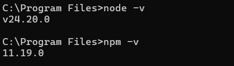
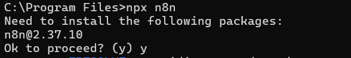
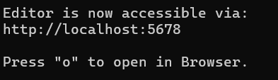
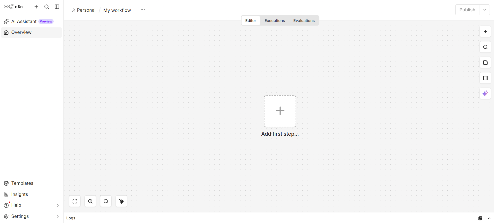

# n8n Installation and Configuration Guide

This guide walks through installing n8n locally using npm and configuring the settings you will most commonly need for local development and testing.

**Scope:** This guide covers the npm/npx installation method, intended for local development and testing. It does not cover Docker or production deployment.

---

## Prerequisites

Before you begin, make sure you have the following installed:

- **Node.js**, version 20 or later. Check your version by running:
  ```
  node -v
  ```
- **npm**, which comes bundled with Node.js. Check your version by running:
  ```
  npm -v
  ```

> **Note:** If you do not have Node.js installed, download it from [nodejs.org](https://nodejs.org) before continuing.



---

## Step 1: Start n8n

Open your terminal and run:

```
npx n8n
```

This downloads everything n8n needs to run and starts the application. You do not need to install anything globally first.

> **Note:** Large installs can occasionally fail with an `EIDLETIMEOUT` error if the connection to the npm registry stalls. If this happens, retry the command. If it persists, increase npm's timeout with `npm config set fetch-timeout 600000` before retrying, or install n8n globally instead with `npm install n8n -g`.



Once the download finishes, n8n starts a local server. You should see log output in your terminal confirming it is running, along with the local address it is available at.



---

## Step 2: Open the n8n editor

In your browser, go to:

```
http://localhost:5678
```



---

## Step 3: Create your owner account

The first time you open n8n, it prompts you to create an owner account for this instance. Fill in your email, first and last name, and a password.

Click **Next** and finally **Finish Setup** to complete this step. You are then taken to the main workflow editor.
Select **Build workflow**.


At this point, n8n is installed and running locally.

---

## Configuration

n8n is configured primarily through environment variables, set before you start the application. The variables below cover the most common setup adjustments.

### Setting environment variables

On macOS or Linux, set a variable before starting n8n:

```
export N8N_HOST=localhost
npx n8n
```

On Windows (Command Prompt):

```
set N8N_HOST=localhost
npx n8n
```

Variables set this way only apply to that terminal session. If you close the terminal, you will need to set them again before your next `npx n8n` run.

### Common configuration variables

| Variable | Purpose | Example |
|---|---|---|
| `N8N_HOST` | The hostname n8n binds to | `localhost` |
| `N8N_PORT` | The port n8n runs on (default is 5678) | `5678` |
| `N8N_PROTOCOL` | Whether n8n is served over http or https | `http` |
| `GENERIC_TIMEZONE` | Timezone used for scheduling nodes and logs | `Asia/Kolkata` |
| `N8N_LOG_LEVEL` | How much detail appears in the terminal log | `info` |
| `WEBHOOK_URL` | The public-facing URL n8n uses for webhook nodes | `http://localhost:5678/` |

> **Note:** `WEBHOOK_URL` only needs to be changed if you are exposing your local instance to the internet, for example with a tunnel, so that external services can reach your webhook nodes. For purely local testing, the default is fine.


### Verifying a configuration change

After setting a variable and restarting n8n, the change reflects in the startup log lines, or in the affected setting itself (for example, the port n8n reports listening on).


---

## Stopping n8n

To stop the running instance, return to the terminal where it is running and press:

```
Ctrl + C
```

Your workflows and owner account are not affected by stopping the process. Since this setup uses npx without a persistent database configured, check the Data Storage note below regarding what is retained between sessions.

> **Note:** By default, n8n stores its data (workflows, credentials, executions) in a local SQLite database on your machine, not in memory, so it does persist across restarts unless you delete that data directory.

---

## Troubleshooting

1. **Port 5678 is already in use**
Another process, possibly a previous n8n session, is using the port. Either stop that process or set a different port with `N8N_PORT` before starting n8n again.

2. **Browser shows "connection refused" at localhost:5678**
n8n may still be starting up. Check your terminal for a confirmation message before refreshing the page.

3. **Environment variable does not seem to apply**
Confirm you set the variable in the same terminal session before running `npx n8n`. Variables set in a different terminal window or a previous session do not carry over.
