# Table of Contents

- [Trello Automation](#trello-automation)
  - [How Trello Automation Works](#how-trello-automation-works)
  - [Prerequisites](#prerequisites)
  - [Create Automation](#create-automation)
  - [Create a Card Button](#create-a-card-button)
  - [Create a Scheduled Automation](#create-a-scheduled-automation)
  - [Troubleshooting](#troubleshooting)
    - [The automation did not run](#the-automation-did-not-run)
    - [The automation performed an unexpected action](#the-automation-performed-an-unexpected-action)
  - [Best Practices](#best-practices)
  - [Summary](#summary)

---

## Trello Automation
Trello Automation allows users to automate repetitive actions on their boards. Instead of manually performing the same action each time a card changes, you can configure an automation to perform the action automatically when a specified condition is met. 
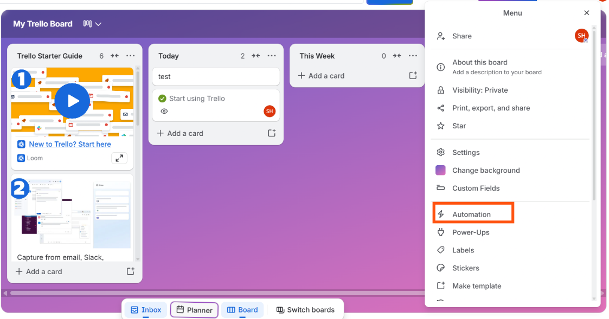

For example, you can create an automation that moves a card to a specific list when a particular action occurs, or performs an action when a card is moved to another list. 

This guide explains how to create and manage common automations in Trello.
### How Trello Automation Works
A Trello automation generally consists of a trigger and one or more actions.
Trigger: Defines when the automation should run.
Action: Defines what Trello should do when the trigger occurs.
For example,
When a card is moved to the Done list (trigger), mark the card as complete (action).
Depending on the automation type, you can create automations based on rules, card buttons, board buttons, or scheduled events.
#### Prerequisites
Before creating an automation:
Sign in to Trello.
Open the board where you want to create the automation.
Create at least one list and a few cards that you can use to test the automation.
Note: Ensure you have the permission to configure automation on the board.
#### Create Automation
To create an automation rule in your board, follow the steps below. 
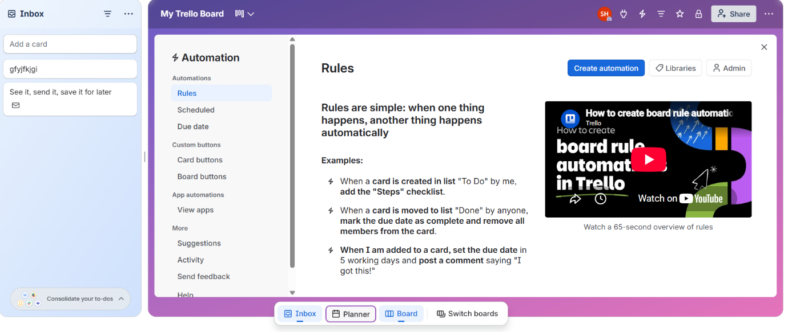

Click the Create automation button at the top right. 
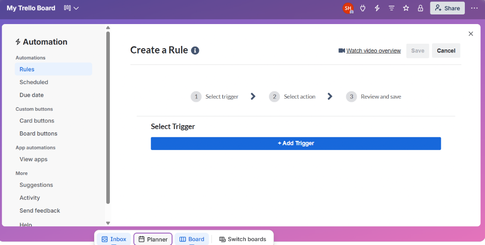

In the Create a Rule page, click the Add Trigger button. 
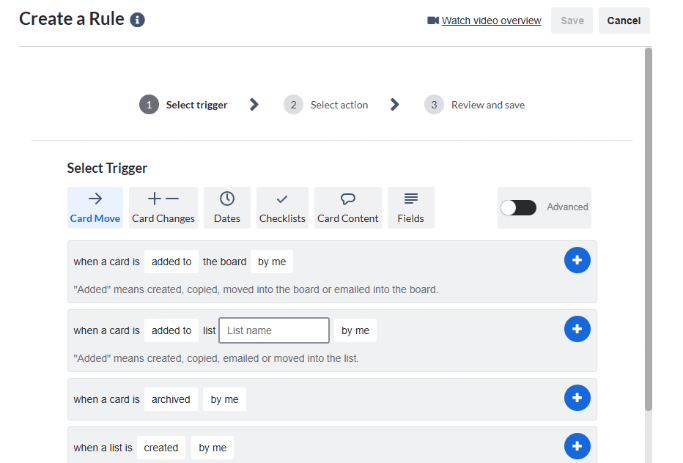

For the Select Trigger step, select the required trigger category from the given options. For example, Card Move.
For the required trigger condition from the options displayed, add the required conditions. 
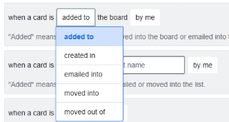
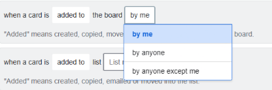

Click the + (plus) icon next to the required trigger to add it to the rule. 
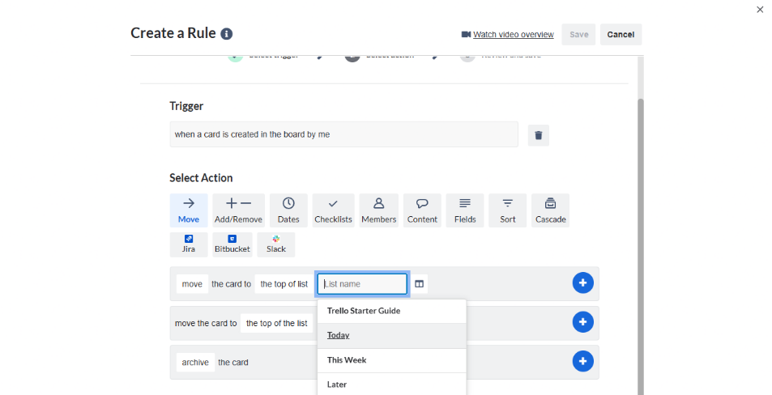

Once the Trigger is selected, select the required action from the available options.
Select the appropriate action category.
For the required action from the options displayed, select the relevant conditions.
Click the + (plus) icon next to the action to add it to the rule. 
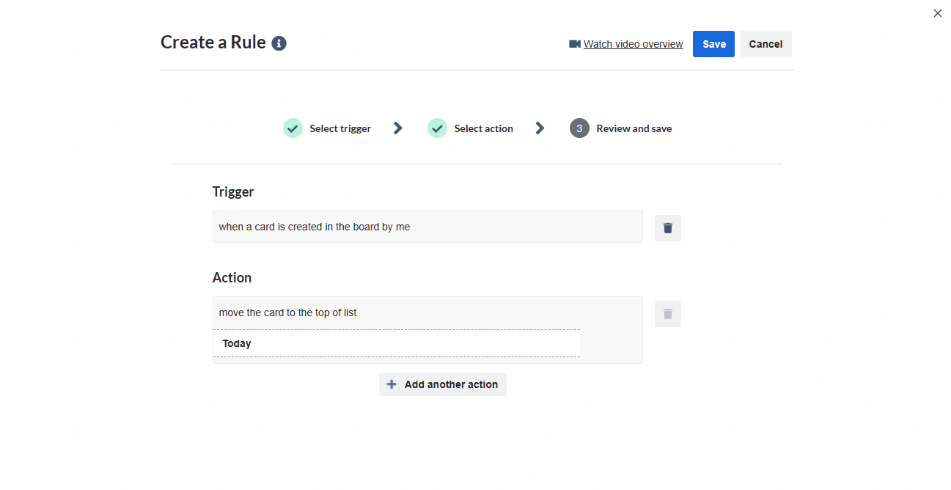

Review the rule configuration.
Once you are ready, click Save at the top right.
#### Create a Card Button
Card buttons allow users to manually trigger an automation from a card by clicking a button. 
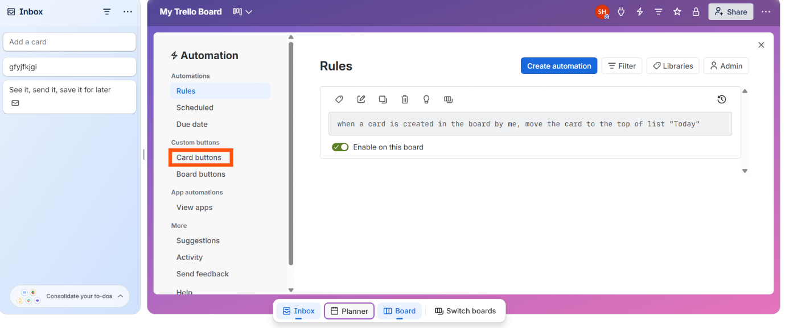

To create a button, follow the steps below.
Click Card buttons on the left sidebar of your board. 
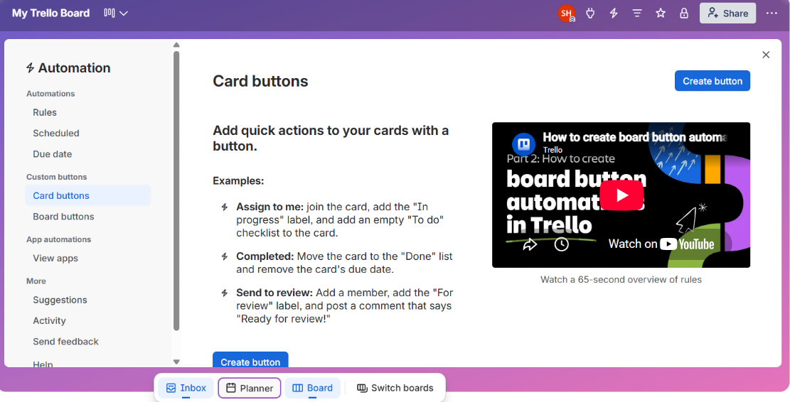

In the Card buttons page click Create button at top right. 
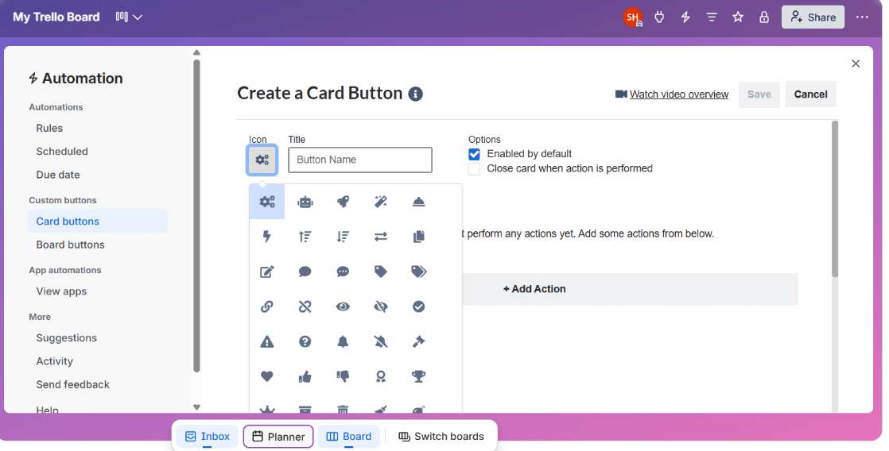

Click the Icon button and select the appropriate icon for the button.
Add an appropriate Button Name.
Select Enabled by default and/or Close card when action is performed checkboxes if required.
Note: Selecting Close card when action is performed archives the card automatically. Choose the option only if that is the intended outcome.
Once all the configurations are complete, click Add Action. The Select an Action section appears. 
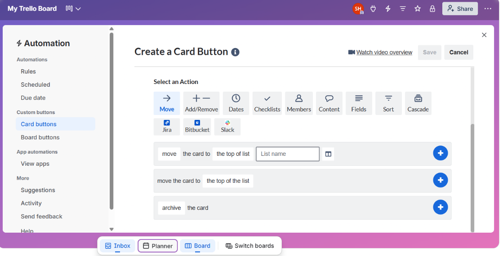

Select the appropriate action category.
For the required action from the options displayed, select the relevant conditions.
Click the + (plus) icon next to the required action to add it to the button. The selected action is performed when you click the button. 
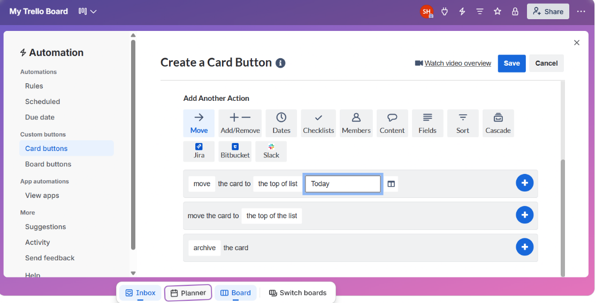

Once the configuration is complete, click Save at the top right.
#### Create a Scheduled Automation
Scheduled automations allow you to configure actions that run according to a schedule.
For example, you could configure an automation to perform a recurring action on your board at a specified time. 
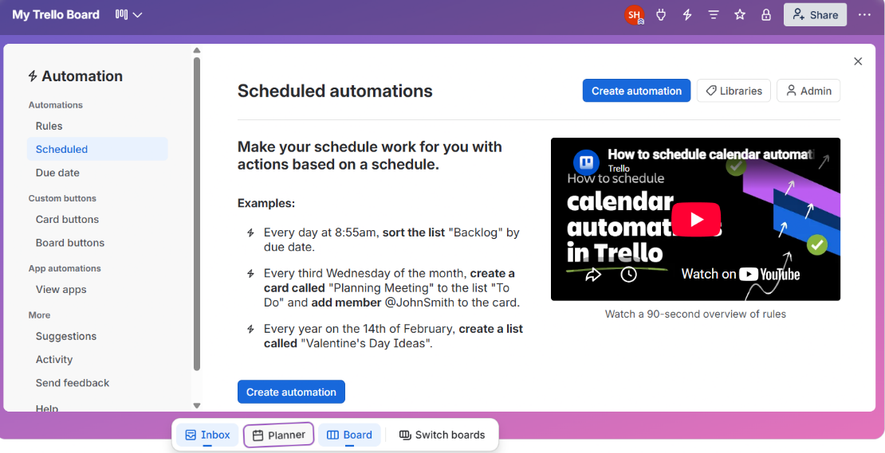

Select Scheduled from the left sidebar.
In the Scheduled automations page, click Create automation. 
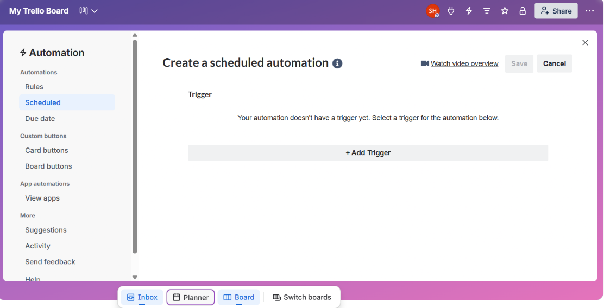

In the Create a scheduled automation page, click Add Trigger. 
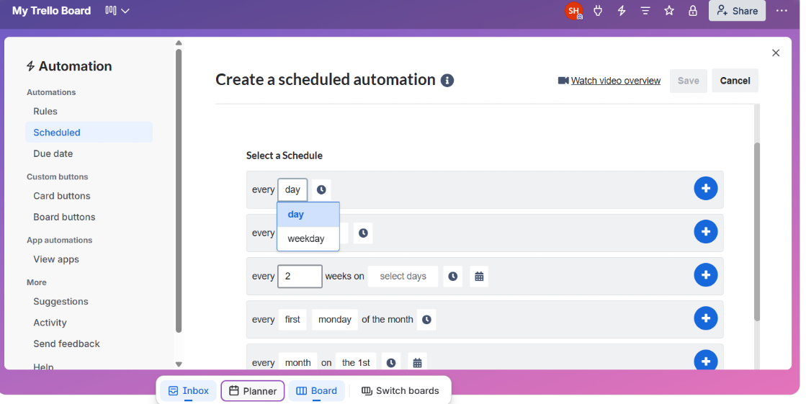

Choose an appropriate scheduling and select the required schedule conditions.
Click the + (plus) icon next to the required schedule to add it. 
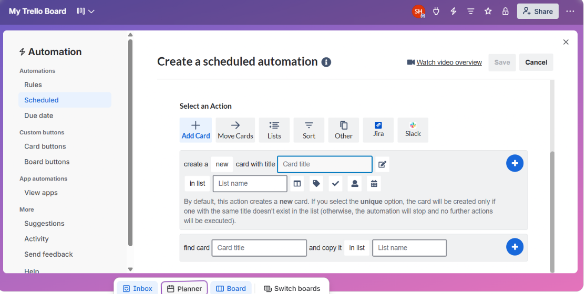

Select the appropriate action category.
For the required action from the options displayed, select the relevant conditions.
Click the + (plus) icon next to the required action. The selected action will be performed at the scheduled interval. 
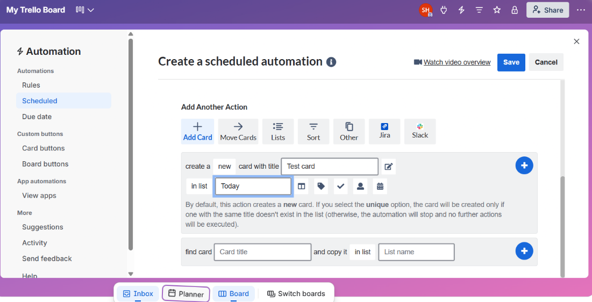

Once the configuration is complete, click Save.
### Troubleshooting
#### The automation did not run
Check the following:
Confirm that the automation is saved and enabled.
Verify that the trigger condition was actually met.
Check that the configured action is valid.
Test the automation with a new card.
Review the automation configuration for incorrect conditions.
#### The automation performed an unexpected action
Review the automation configuration and check all actions associated with the trigger. If multiple automations are configured on the same board, verify whether another automation could have affected the card.
### Best Practices
When creating Trello automations:
Start with simple automations and test them before creating complex workflows.
Use descriptive names for automations.
Test automations with sample cards before applying them to active workflows.
Review existing automations before creating a new one to avoid duplicate actions.
Document important automations so that other board members understand their purpose.
### Summary
Trello Automation can reduce repetitive board-management tasks by automatically performing actions based on defined triggers, user actions, or schedules.
By combining triggers with actions, teams can create automated workflows that help keep their boards organized and reduce manual work.
